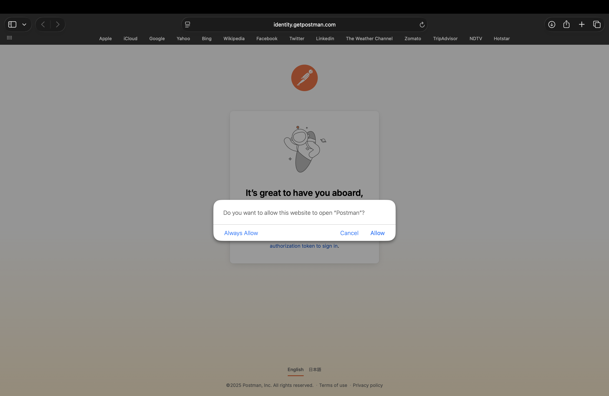

# Creating a Postman Account

| Field | Value |
|--------|-------|
| Audience | Beginners with little or no experience working with APIs |
| Document Type | Task |
| Estimated Reading Time | 5–10 minutes |
| Prerequisites | Installing Postman |

---

# Purpose

This guide explains how to create a Postman account using either the Postman website or the Postman desktop application. After completing this guide, you will have a Postman account configured and ready to begin using the application.

---

# Prerequisites

Before you begin, ensure that you have:

- Installed the Postman desktop application.
- A stable internet connection.
- Access to an email account.

---

# Choose how to create your account

You can create a Postman account in either of the following ways:

- From the Postman website before opening the desktop application.
- From the Postman desktop application after installation.

Both methods use the same account creation process.

---

# Method 1: Create an account from the Postman website

1. Open your preferred web browser.

2. Navigate to:

   ```
   https://www.postman.com
   ```

3. Select **Sign Up for Free**.

   

4. The **Create Postman account** page opens.

---

# Create your account

1. Enter your **Work email**.

2. Enter a **Username**.

3. Create a **Password**.

4. (Optional) Select either or both of the following options:

   - **Receive product updates, news, and other marketing communications**
   - **Stay signed in**

5. Complete the **Verify you are human** verification.

6. Select **Create Free Account**.

   

> **Note**
>
> The marketing communication and **Stay signed in** options are optional.
>
> Completing the **Verify you are human** verification is required before you can create an account.

---

# Alternative sign-up methods

Instead of creating an account with an email address and password, you can choose one of the following options:

- **Sign Up with Google**
- **Sign Up with GitHub**
- **Sign In with SSO (Single Sign-On)**

### Sign Up with Google

Selecting **Sign Up with Google** prompts you to authenticate with your Google account before Postman creates your account.

### Sign Up with GitHub

Selecting **Sign Up with GitHub** prompts you to authenticate with your GitHub account before continuing.

### Sign In with SSO

If your organization uses Single Sign-On (SSO), select **Sign In with SSO** and enter your organization's team domain to continue.

---

# Personalize your workspace

After creating your account, Postman asks you to personalize your workspace.

1. Enter your name.

2. Under **I'd like to**, choose the option that best describes what you want to do in Postman.

   Available options include:

   - Build APIs
   - Test APIs
   - Integrate APIs
   - Lead a team that works with APIs
   - Manage API strategy for my organization
   - Evaluate Postman for my company

   

3. Under **As a**, choose the role that best describes your work.

   Available options include:

   - API Program / Product Manager
   - DevOps / Platform Engineer
   - Student / Educator
   - Engineering Lead / Manager
   - Mobile Developer
   - Frontend Developer
   - QA / Test Engineer
   - Full-stack Developer
   - Data Engineer
   - Backend Developer
   - Engineering Executive
   - Other

   

4. Under **How big is your team?**, select one of the following:

   - 1 member
   - 2–10 members
   - 11–50 members
   - 50+ members

   

---

# Complete the initial setup

After completing the personalization steps, the Postman welcome page appears.

The welcome page asks whether you would like to connect a local project folder.

Choose one of the following:

- **Yes** to connect a local project immediately.
- **No** to skip this step and connect one later.

Connecting a local project is optional.


---

# Launch the desktop application

If you created your account using the Postman website, your web browser may display a confirmation dialog asking whether the website can open the Postman desktop application.

Select one of the following:

- **Allow**
- **Always Allow**

Both options launch the Postman desktop application.

Selecting **Always Allow** automatically opens the desktop application whenever Postman requests permission in the future.


After permission is granted, the desktop application opens and signs you in automatically.

---

# Method 2: Create an account from the Postman desktop application

If you installed Postman before creating an account:

1. Launch the Postman desktop application.

2. Select **Create Free Account**.

   

3. Your web browser opens the **Create Postman account** page.

4. Complete the account creation process described earlier in this guide.

5. After your account has been created, authorize your browser to open the Postman desktop application when prompted.

---

# Verification

Verify that your account has been created successfully.

You should be able to:

- Sign in to the Postman desktop application.
- View the Postman workspace.
- Access your account from both the desktop application and the Postman website.

---

# Summary

You have successfully created a Postman account and completed the initial setup process.

You are now ready to create your first Postman workspace and begin sending API requests.

---

# Related documentation

- Previous guide: **Installing Postman**
- Next guide: **Navigating the Postman Interface**
