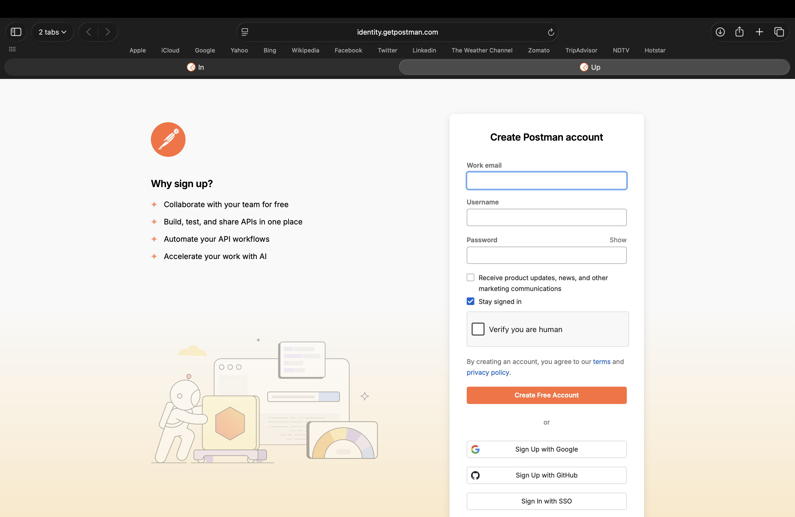
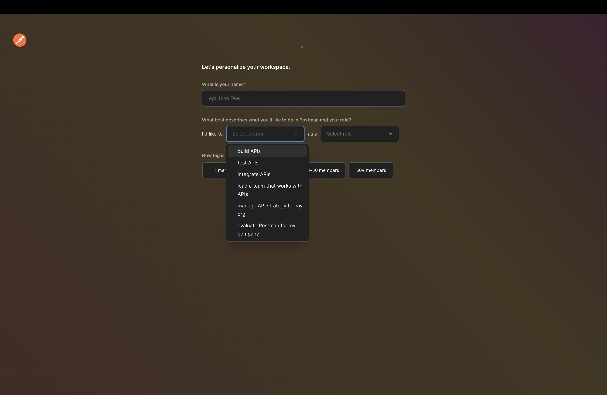
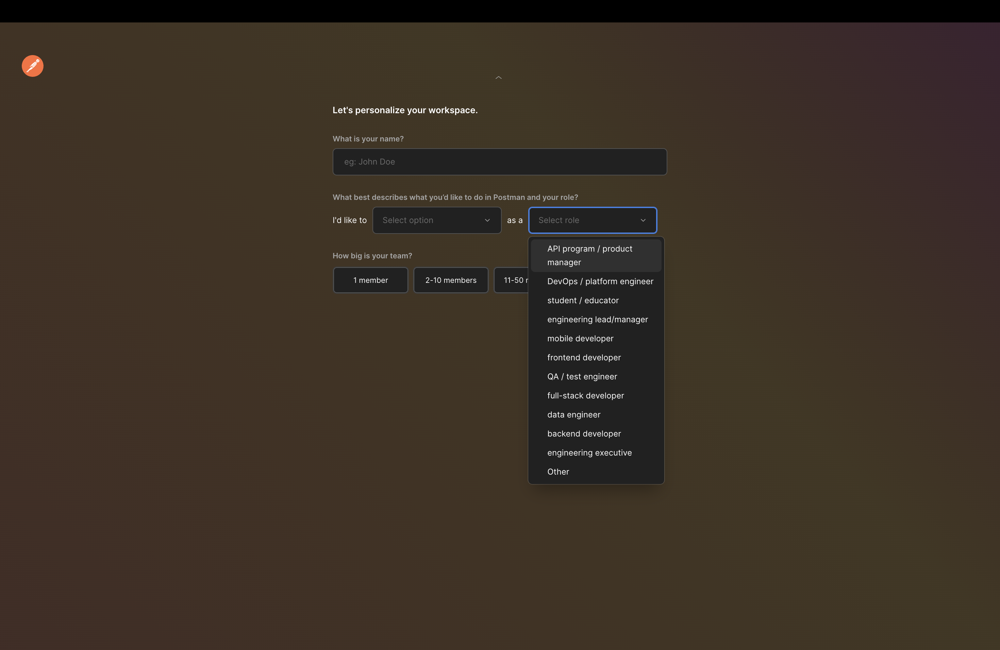
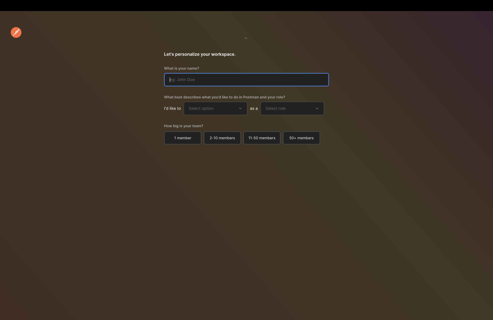
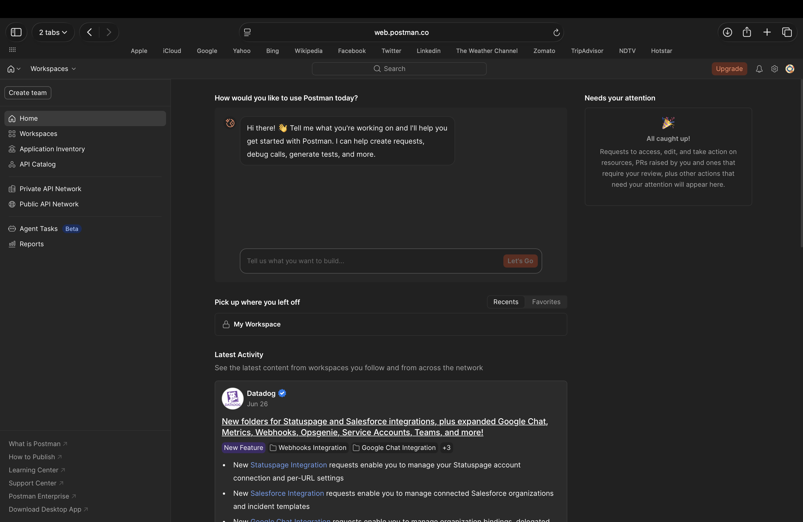
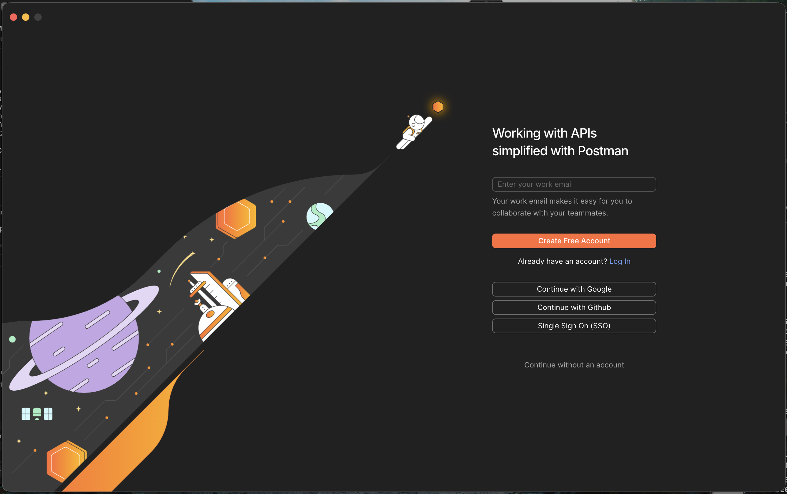
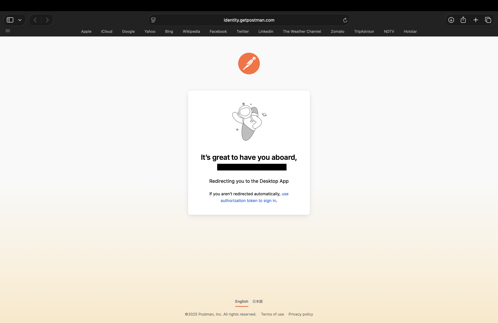
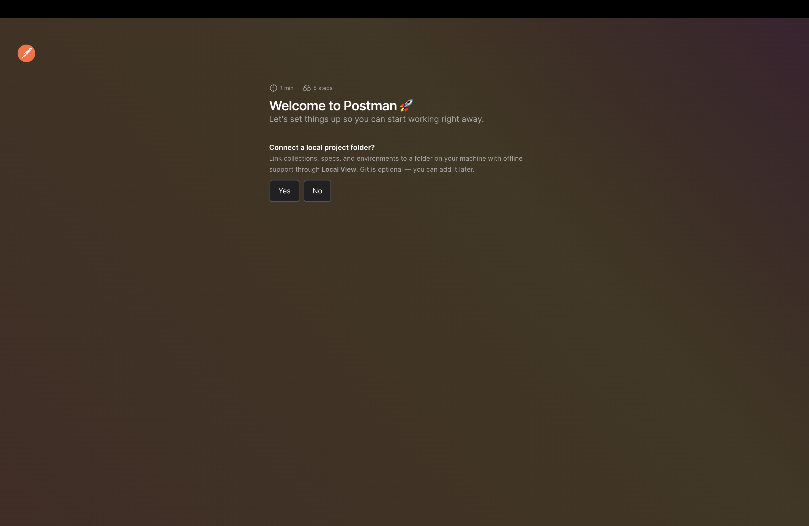

# Creating a Postman Account

| Field | Value |
|--------|-------|
| Audience | Beginners with little or no experience working with APIs |
| Document Type | Task |
| Estimated Reading Time | 5–10 minutes |
| Prerequisites | Installing Postman |

---

# Purpose

This guide explains how to create a Postman account using either the Postman website or the Postman desktop application. After completing this guide, you will have a Postman account configured and ready to begin using Postman.

---

# Prerequisites

Before you begin, ensure that you have:

- Installed the Postman desktop application (if you plan to use the desktop app).
- A stable internet connection.
- Access to an email account.

---

# Choose how to create your account

You can create a Postman account in either of the following ways:

- From the Postman website before opening the desktop application.
- From the Postman desktop application after installation.

Although both methods use the same account creation form, the experience after account creation differs slightly.

---

# Method 1: Create an account from the Postman website

1. Open your preferred web browser.

2. Navigate to:

   ```
   https://www.postman.com
   ```

3. Select **Sign Up for Free**.

   

4. The **Create Postman account** page opens.

---

# Create your account

1. Enter your **Work email**.

2. Enter a **Username**.

3. Create a **Password**.

4. (Optional) Select either or both of the following:

   - **Receive product updates, news, and other marketing communications**
   - **Stay signed in**

5. Complete the **Verify you are human** verification.

6. Select **Create Free Account**.

   

> **Note**
>
> The marketing communication and **Stay signed in** options are optional.
>
> Completing the **Verify you are human** verification is required before creating an account.

---

# Alternative sign-up methods

Instead of creating an account using an email address and password, you can choose one of the following options:

- **Sign Up with Google**
- **Sign Up with GitHub**
- **Sign In with SSO (Single Sign-On)**

### Sign Up with Google

Selecting **Sign Up with Google** prompts you to authenticate with your Google account before Postman creates your account.

### Sign Up with GitHub

Selecting **Sign Up with GitHub** prompts you to authenticate with your GitHub account before continuing.

### Sign In with SSO

If your organization uses Single Sign-On (SSO), select **Sign In with SSO** and enter your organization's team domain to continue.

---

# Personalize your workspace

After creating your account, Postman asks you to personalize your workspace.

1. Enter your name.

2. Under **I'd like to**, choose the option that best describes what you want to do in Postman.

   Available options include:

   - Build APIs
   - Test APIs
   - Integrate APIs
   - Lead a team that works with APIs
   - Manage API strategy for my organization
   - Evaluate Postman for my company

   

3. Under **As a**, choose the role that best describes your work.

   Available options include:

   - API Program / Product Manager
   - DevOps / Platform Engineer
   - Student / Educator
   - Engineering Lead / Manager
   - Mobile Developer
   - Frontend Developer
   - QA / Test Engineer
   - Full-stack Developer
   - Data Engineer
   - Backend Developer
   - Engineering Executive
   - Other

   

4. Under **How big is your team?**, select one of the following:

   - 1 member
   - 2–10 members
   - 11–50 members
   - 50+ members

   

5. Select **Continue** to finish the setup.

---

# Complete the setup from the website

If you created your account from the Postman website, Postman finishes setting up your account and opens your Postman workspace in the browser.



From here, you can begin using the Postman web application immediately or later sign in to the desktop application using the same account.

---

# Method 2: Create an account from the Postman desktop application

If you installed Postman before creating an account:

1. Launch the Postman desktop application.

2. Select **Create Free Account**.

   

3. Your default web browser opens the same **Create Postman account** page used when signing up directly through the Postman website.

4. Complete the account creation process described earlier in this guide.

5. Complete the personalization questions.

---

# Return to the desktop application

After completing the account creation process in your browser, Postman displays a greeting page indicating that it is preparing to redirect you back to the desktop application.



The greeting page automatically changes to a page that launches the desktop application.


Your browser may display a confirmation dialog asking whether you want to allow the website to open the Postman desktop application.

Choose one of the following:

- **Allow**
- **Always Allow**

Selecting **Always Allow** automatically opens the Postman desktop application whenever Postman requests permission in the future.


---

# Welcome to Postman

Once the desktop application opens successfully, the Welcome page appears.

You are asked whether you would like to connect a local project folder.

Choose one of the following:

- **Yes** to connect a local project immediately.
- **No** to skip this step and connect one later.

Connecting a local project folder is optional.



---

# Verification

Verify that your account has been created successfully.

You should be able to:

- Sign in to the Postman desktop application.
- Sign in to the Postman web application.
- Access the same account from both platforms.

---

# Summary

You have successfully created a Postman account.

Depending on the method you chose, you can now use Postman through your web browser or the desktop application. Both platforms use the same account, allowing you to switch between them whenever needed.

---

# Related documentation

- Previous guide: **Installing Postman**
- Next guide: **Navigating the Postman Interface**
