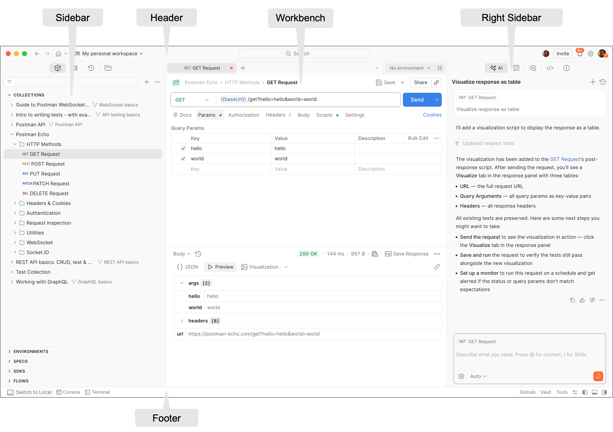

# Understanding the Postman Interface

| Field | Value |
|--------|-------|
| Audience | Beginners with little or no experience working with APIs |
| Document Type | Concept |
| Estimated Reading Time | 8–10 minutes |
| Prerequisites | Installing Postman, Creating a Postman Account |

---

# Purpose

This guide introduces the main areas of the Postman interface and explains the purpose of each section. After completing this guide, you will be able to identify the primary components of the Postman workspace and understand where to perform common tasks.

---

# Prerequisites

Before you begin, ensure that you have:

- Installed the Postman desktop application.
- Created a Postman account.
- Signed in to Postman.

---

# The Postman interface at a glance

After signing in, Postman opens your workspace, where you can create, organize, test, and manage API requests.

The Postman interface is divided into several sections, each designed for a specific purpose. Understanding these sections makes it easier to navigate the application and locate the tools you need while working with APIs.

The major areas of the interface include:

- Header
- Sidebar
- Workbench
- Request Builder
- Response Viewer
- Environment Selector
- Right Sidebar
- Footer

The following annotated diagram identifies the primary sections discussed throughout this guide.

*Source: Adapted from the official Postman documentation. Original image © Postman, Inc. Available at: https://assets.postman.com/postman-docs/v12/workspace-diagram-02-28-26-v2.png*

> **Tip**
>
> You do not need to memorize every part of the interface immediately. As you continue through this guide, you will naturally become familiar with the areas that you use most frequently.

---

# Header

The **Header** appears across the top of the Postman window.

It provides quick access to commonly used application controls and workspace settings. From the Header, you can:

- Switch between workspaces.
- Search across your workspace.
- Access notifications.
- Open application settings.
- View your profile.
- Invite collaborators to your workspace.

The Header remains visible regardless of which workspace or request you have open, allowing you to quickly navigate between different parts of Postman.

Refer to the annotated interface overview above to locate the Header.

---

# Sidebar

The **Sidebar** is located along the left side of the application window.

It serves as the primary navigation area for your workspace and provides access to the resources you create and manage while working in Postman.

Depending on your workspace configuration and Postman plan, the Sidebar may contain:

- Collections
- APIs
- Environments
- Flows
- History
- Mock Servers
- Monitors
- Team resources

As your projects grow, the Sidebar becomes the main place for organizing and locating your work.

For example, instead of searching manually for an API request, you can expand a collection from the Sidebar and select the request you want to open.

> **Note**
>
> The items displayed in the Sidebar may vary depending on your Postman plan, workspace configuration, and enabled features.

Refer to the annotated interface overview above to locate the Sidebar.

---

# Workbench

The **Workbench** is the central working area of the Postman interface.

Whenever you create or open an API request, it appears inside the Workbench. Most of your day-to-day work in Postman takes place here.

Common tasks performed in the Workbench include:

- Creating API requests.
- Editing existing requests.
- Sending requests.
- Viewing API responses.
- Working with multiple open tabs simultaneously.

The Workbench also contains several components that work together whenever you send an API request, including the:

- Request Builder
- Response Viewer
- Environment Selector

These components are covered in the next sections of this guide.

Refer to the annotated interface overview above to locate the Workbench.

---

# Request Builder

The **Request Builder** is where you create and configure HTTP requests.

Before sending a request to an API, you use the Request Builder to specify how the request should be made.

The Request Builder includes several key components:

- HTTP method selector
- Request URL field
- **Send** button
- Request tabs

The request tabs allow you to configure different parts of your request, including:

- **Params** – Add query parameters to the request URL.
- **Authorization** – Configure authentication credentials required by the API.
- **Headers** – Specify additional request metadata.
- **Body** – Include data that is sent to the API, such as JSON or form data.
- **Scripts** – Add scripts that run before or after a request.
- **Settings** – Configure request-specific behavior.

Not every request requires all of these options. For example, many **GET** requests only require a URL, while **POST** or **PUT** requests commonly include a request body.

> **Tip**
>
> If you're new to APIs, don't worry about understanding every tab immediately. Throughout this guide, you'll learn when and why each option is used.

Refer to the annotated interface overview above to locate the Request Builder.

---

# Response Viewer

After you send a request, Postman displays the server's response in the **Response Viewer**.

The Response Viewer helps you understand how the server processed your request and whether it was successful.

Information displayed in the Response Viewer includes:

- Response body
- HTTP status code
- Response time
- Response size
- Response headers
- Cookies

Depending on the API, the response body may be displayed in formats such as:

- JSON
- XML
- HTML
- Plain text

You can also switch between different response views to inspect the returned data more effectively.

Reviewing the response is one of the most important parts of API testing because it confirms whether your request produced the expected result.

Refer to the annotated interface overview above to locate the Response Viewer.

---

# Environment Selector

The **Environment Selector** appears near the top of the Workbench.

Environments allow you to store reusable values, such as:

- Base URLs
- API keys
- Authentication tokens
- Variable values

Instead of manually changing these values every time you work with a different API or deployment environment, you can switch environments using the Environment Selector.

For example, you might use separate environments for:

- Development
- Testing
- Production

Selecting a different environment automatically updates any variables referenced in your requests.

> **Note**
>
> Environments are covered in greater detail later in this guide. At this stage, it is only important to understand where the Environment Selector is located and what it is used for.

Refer to the annotated interface overview above to locate the Environment Selector.

---

# Right Sidebar

The **Right Sidebar** provides contextual tools and information related to the item currently open in the Workbench.

Depending on your version of Postman and the features enabled for your workspace, the Right Sidebar may include:

- AI assistance
- Comments
- Documentation
- Request information
- Collaboration tools

Because the contents of the Right Sidebar change depending on what you are working on, you may not always see the same options displayed.

Most beginners spend very little time using the Right Sidebar initially. As you become more familiar with Postman, these contextual tools become increasingly useful.

Refer to the annotated interface overview above to locate the Right Sidebar.

---

# Footer

The **Footer** appears at the bottom of the Postman window.

It provides quick access to supporting tools that help you inspect requests and troubleshoot issues while working with APIs.

Depending on your version of Postman, the Footer may include tools such as:

- Console
- Terminal
- Local View
- Cookies
- Additional developer utilities

One of the most commonly used tools is the **Postman Console**, which displays detailed information about requests, responses, variables, and errors.

If a request does not behave as expected, the Console is often the first place to investigate the problem.

Refer to the annotated interface overview above to locate the Footer.

---

# Putting it all together

Now that you have explored the major areas of the Postman interface, you can see how they work together during a typical workflow.

For example, when creating and sending an API request, you would generally:

1. Select the appropriate workspace from the **Header**.
2. Locate or create a collection from the **Sidebar**.
3. Open or create a request in the **Workbench**.
4. Configure the request using the **Request Builder**.
5. Select an environment, if required.
6. Send the request.
7. Review the server's response in the **Response Viewer**.
8. Use the **Right Sidebar** or **Footer** tools if you need additional information or troubleshooting assistance.

As you continue learning Postman, these steps will become part of your regular workflow.

---

# Verification

Verify that you can complete the following tasks:

- Locate the Header.
- Locate the Sidebar.
- Identify the Workbench.
- Find the Request Builder.
- Locate the Response Viewer.
- Find the Environment Selector.
- Locate the Right Sidebar.
- Open the Footer and identify the Postman Console.

If you can identify these interface components, you are ready to begin creating and sending API requests.

---

# Summary

In this guide, you learned how the Postman interface is organized and the purpose of its primary components.

You should now be able to:

- Navigate the Postman workspace.
- Identify the major interface components.
- Understand where API requests are created and responses are displayed.
- Locate common tools used throughout the application.

Understanding the interface provides the foundation for the remaining guides in this series.

---

# Related documentation

- Previous guide: **Creating a Postman Account**
- Next guide: **Sending Your First API Request**
