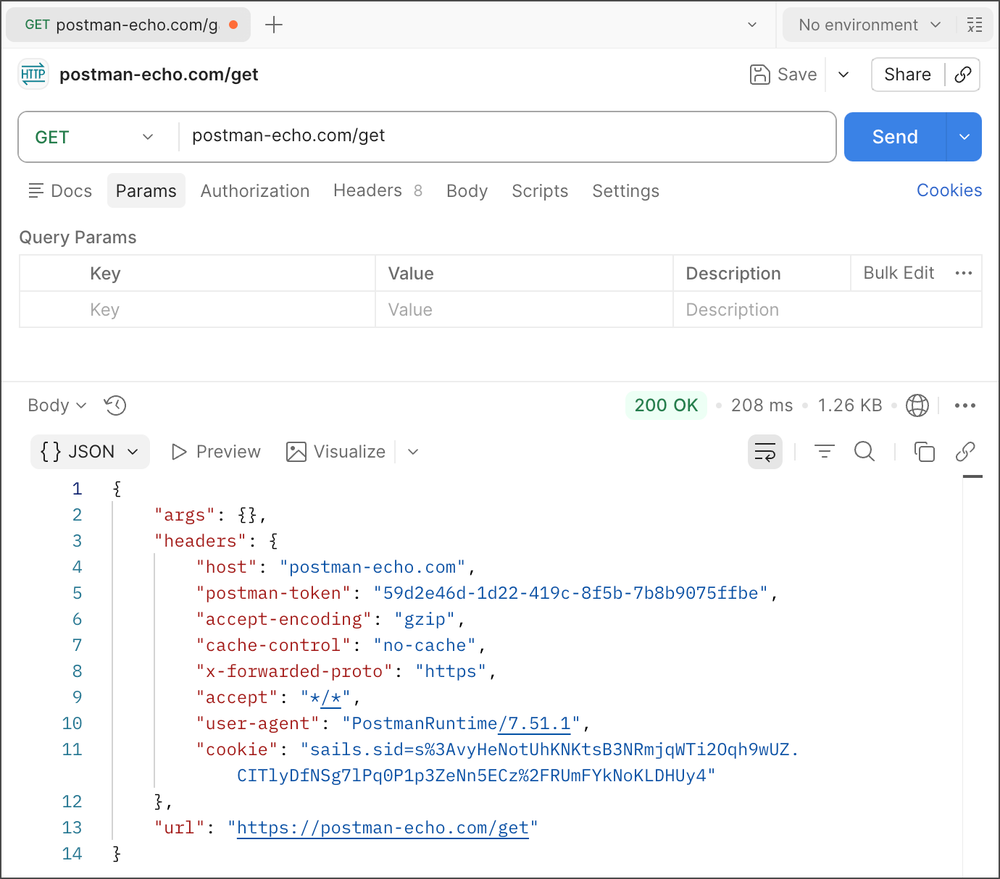

# Sending Your First GET Request

| Field | Value |
|--------|-------|
| Audience | Beginners with little or no experience working with APIs |
| Document Type | Task |
| Estimated Reading Time | 5–7 minutes |
| Prerequisites | Understanding the Postman Interface |

---

# Purpose

This guide walks you through sending your first HTTP GET request using Postman. By the end of this guide, you will understand what a GET request is, how to send one using the Postman Echo API, and what happens after you click **Send**.

---

# Prerequisites

Before you begin, ensure that you have:

- Installed the Postman desktop application.
- Created and signed in to your Postman account.
- Familiarised yourself with the Postman interface.

---

# What is a GET request?

A **GET** request is an HTTP method used to retrieve information from a server.

Unlike methods such as **POST**, **PUT**, or **DELETE**, a GET request does **not** change or modify any data on the server. Instead, it simply requests existing information and returns it to the client.

GET is one of the most commonly used HTTP methods and is often the first request developers send when learning to work with APIs.

For this exercise, you will use the **Postman Echo API**, a publicly available service created by Postman for learning and testing API requests.

---

# The request you will send

Throughout this guide, you will send a request to the following endpoint:

```
https://postman-echo.com/get
```

The Postman Echo API simply returns information about the request it receives, making it an ideal endpoint for learning how requests and responses work.

For this request, you do **not** need to configure:

- Query parameters
- Authentication
- Headers
- Request body

Only the request URL is required.

> **Note**
>
> Some APIs require additional information to be sent with the request, such as query parameters. In Postman, you can add these either directly to the URL or by using the **Params** tab. For this introductory exercise, the Postman Echo endpoint works without any additional parameters, allowing you to focus on the basic request workflow.

---

# Sending your first GET request

1. Open the Postman desktop application.

2. Click the **+** button in the Workbench to create a new request tab.

3. Ensure that the HTTP method is set to **GET**.

4. Enter the following URL into the request field:

   ```
   https://postman-echo.com/get
   ```

5. Click **Send**.

After a few moments, Postman sends the request to the Postman Echo server and displays the response in the Response Viewer.



*Figure 1. Sending a GET request to the Postman Echo API.*

> **Tip**
>
> If you receive an error instead of a successful response, verify that the request URL has been entered correctly and that you have an active internet connection.

---

# What happens when you click **Send**?

When you click **Send**, Postman performs several actions automatically:

1. It creates an HTTP GET request using the URL you entered.
2. The request is transmitted over the internet to the Postman Echo server.
3. The server processes the request.
4. The server sends a response back to Postman.
5. Postman displays the response in the Response Viewer.

This communication between the client (Postman) and the server forms the basis of how APIs exchange information.

You will explore the Response Viewer in more detail in the next guide.

---

# Verification

Verify that you can successfully:

- Create a new request.
- Select the **GET** HTTP method.
- Enter the request URL.
- Send the request.
- Receive a successful response from the Postman Echo API.

If you can complete these steps, you have successfully sent your first API request.

---

# Summary

In this guide, you learned how to send your first GET request using the Postman Echo API.

You should now be able to:

- Explain the purpose of a GET request.
- Create a new request in Postman.
- Send a request to an API endpoint.
- Successfully receive a response from an API.

In the next guide, you will learn how to read and interpret the response returned by the server.

---

# Related documentation

- Previous guide: **Understanding the Postman Interface**
- Next guide: **Reading the Response**
