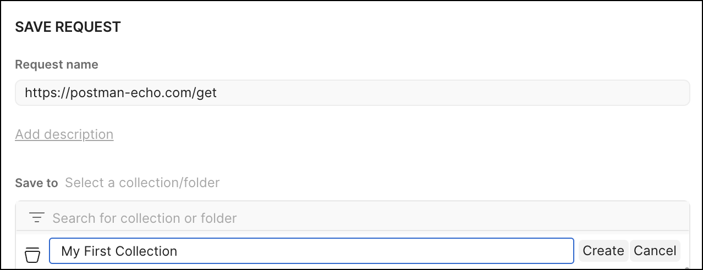
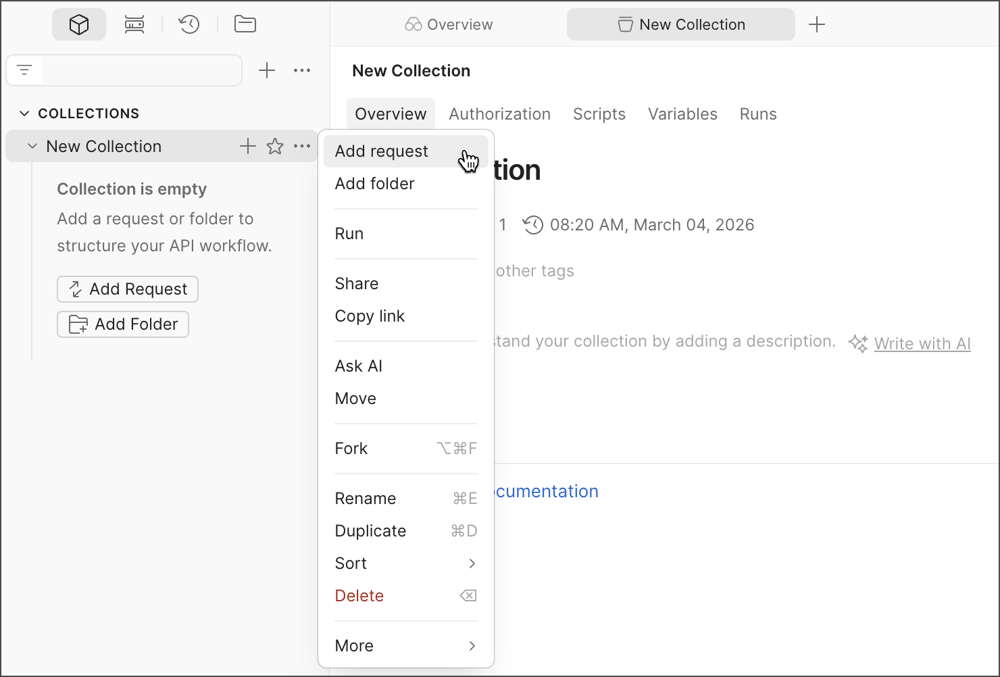

# Saving a Request

| Field | Value |
|--------|-------|
| Audience | Beginners with little or no experience working with APIs |
| Document Type | Task |
| Estimated Reading Time | 4–6 minutes |
| Prerequisites | Reading the Response |

---

# Purpose

This guide explains how to save an API request in Postman by adding it to a collection. By the end of this guide, you will understand what collections are, why they are useful, and how to save your first request for future use.

---

# Prerequisites

Before you begin, ensure that you have:

- Installed the Postman desktop application.
- Created and signed in to your Postman account.
- Successfully sent your first GET request.

---

# Why save a request?

When you create a request in Postman, it remains open only for the current session unless you save it.

Saving requests allows you to:

- Reuse requests without recreating them.
- Organise related requests into collections.
- Share requests with teammates.
- Add documentation, tests, and examples to requests later.

As your projects grow, saving requests makes them much easier to manage.

---

# Understanding Collections

A **Collection** is a group of saved API requests.

Collections can also contain:

- Folders
- Documentation
- Variables
- Test scripts
- Saved examples

Think of a collection as a project folder that keeps related API requests organised in one place.

---

# Saving your first request

If you have just completed the previous guide, your GET request should still be open in the request builder.

1. Click **Save** in the upper-right corner of the request builder.

2. The **Save Request** dialog box opens.

3. Under **Save to**, click **New Collection**.

4. Enter a name for your collection.

   For example:

   ```
   My First Collection
   ```

5. Leave the default request name unchanged, or enter a more descriptive name if you prefer.

6. Click **Create**.

7. Your request is automatically saved inside the newly created collection.



*Figure 1. Creating a new collection while saving your first request.*

> **Image Credit**
>
> Adapted from the Postman Learning Center documentation. Original image © Postman, Inc. Used for educational purposes. :contentReference[oaicite:0]{index=0}

---

# Viewing your saved request

After saving the request, the **Collections** section in the left sidebar updates automatically.

Expand your collection to view the saved request.

You can also add additional requests or folders by selecting the **More actions** menu (**⋯**) beside the collection name and choosing **Add request** or **Add folder**.



*Figure 2. Adding requests or folders to a collection from the collection menu.*

> **Image Credit**
>
> Adapted from the Postman Learning Center documentation. Original image © Postman, Inc. Used for educational purposes. :contentReference[oaicite:1]{index=1}

---

# Why use collections?

Even small API projects can contain dozens of requests.

Collections help you:

- Keep related requests together.
- Find requests quickly.
- Organise requests into folders.
- Share API workflows with teammates.
- Reuse requests across multiple sessions.

Later in this guide, you'll explore collections in greater detail, including folders, variables, documentation, and collaboration features.

> **Tip**
>
> Give collections meaningful names that describe the API or project they contain. As you create more collections, descriptive names make them much easier to locate.

---

# Verification

Verify that you can successfully:

- Open the **Save Request** dialog.
- Create a new collection.
- Save your GET request inside the collection.
- Locate the collection in the **Collections** sidebar.
- Expand the collection to view the saved request.

If you can complete these steps, you have successfully saved your first API request.

---

# Summary

In this guide, you learned how to save a request in Postman by creating a new collection.

You should now be able to:

- Explain what a collection is.
- Create a new collection.
- Save an API request.
- Locate saved requests in the Collections sidebar.

In the next guide, you will learn more about **Collections** and how they help organise API projects.

---

# Related documentation

- Previous guide: **Reading the Response**
- Next guide: **Collections**
