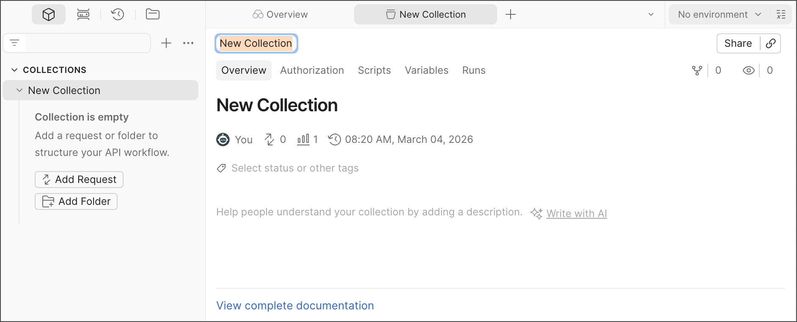
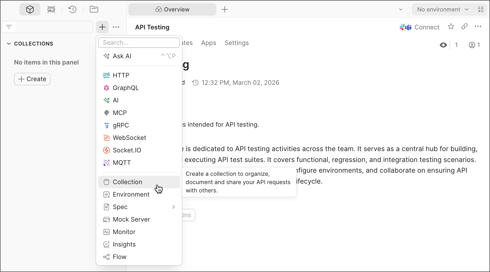

# Collections

| Field | Value |
|--------|-------|
| Audience | Beginners with little or no experience working with APIs |
| Document Type | Concept |
| Estimated Reading Time | 5–7 minutes |
| Prerequisites | Saving a Request |

---

# Purpose

This guide introduces **Postman Collections**, one of the core features of Postman. By the end of this guide, you will understand what collections are, why they are useful, and how they help organize API requests as your projects grow.

---

# What is a Collection?

A **Collection** is a group of saved API requests.

Instead of keeping requests in separate tabs, you can organize related requests into a single collection. Collections make it easier to manage APIs, reuse requests, and collaborate with others.

A collection can store more than just requests. It can also include:

- Request parameters
- Headers
- Authorization settings
- Request bodies
- Saved responses
- Tests and scripts
- Variables
- Documentation

As you continue working with APIs, collections become the primary way to organize your work.

---

# Why use Collections?

Collections provide several advantages:

- Keep related API requests together.
- Reuse requests without recreating them.
- Organize requests using folders and subfolders.
- Share API requests with teammates.
- Store reusable settings for multiple requests.

For example, if you're working with a weather API, you might create a collection containing requests for:

- Current weather
- Weather forecast
- Air quality
- Historical weather

Keeping these requests together makes them easier to find and maintain.

---

# The Collection workspace

When you open a collection, Postman displays several tabs that help you manage it.

These include:

- **Overview** – Displays the collection's description and general information.
- **Authorization** – Configure authentication that can be shared by requests in the collection.
- **Scripts** – Add scripts that run before or after every request.
- **Variables** – Store reusable values for the collection.
- **Runs** – Execute multiple requests in the collection together.



*Figure 1. The Collection workspace in Postman.*

> **Image Credit**
>
> Adapted from the Postman Learning Center documentation. Original image © Postman, Inc. Used for educational purposes. :contentReference[oaicite:0]{index=0}

---

# Organizing requests

As collections grow, you can organize requests into folders.

For example:

```
Weather API
├── Current Weather
├── Forecast
├── Historical Data
└── Air Quality
```

Folders help keep related requests together and make large collections easier to navigate.

You can also reorder requests by dragging and dropping them or sort them alphabetically.

---

# Creating a new Collection

There are multiple ways to create a collection in Postman.

You can:

- Click the **+** button and select **Collection**.
- Click **Create** in the **Collections** sidebar.
- Create a new collection while saving a request.

After creating a collection, you can rename it, add a description, configure authorization, and begin adding requests.



*Figure 2. Creating a new collection.*

> **Image Credit**
>
> Adapted from the Postman Learning Center documentation. Original image © Postman, Inc. Used for educational purposes. :contentReference[oaicite:1]{index=1}

---

# Collections grow with your project

Collections are designed to support projects of any size.

As your API grows, a collection can contain:

- Multiple folders
- Dozens or hundreds of requests
- Shared authorization
- Collection variables
- Automated scripts
- Documentation
- Saved examples

Rather than managing individual requests separately, you manage the entire API from one organized location.

---

# Verification

After reading this guide, you should be able to:

- Explain what a Postman Collection is.
- Describe why collections are useful.
- Identify the main tabs within a collection.
- Explain how folders help organize requests.
- Recognize that collections can store more than just API requests.

---

# Summary

In this guide, you learned what Postman Collections are and why they are central to organizing API requests.

You should now understand that collections:

- Group related API requests.
- Store settings and reusable information.
- Help organize larger projects.
- Support collaboration and automation.

In the next guide, you will learn how to organize collections using **Folders**.

---

# Related documentation

- Previous guide: **Saving a Request**
- Next guide: **Folders**
