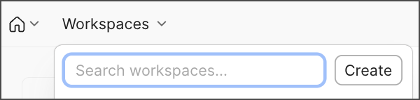
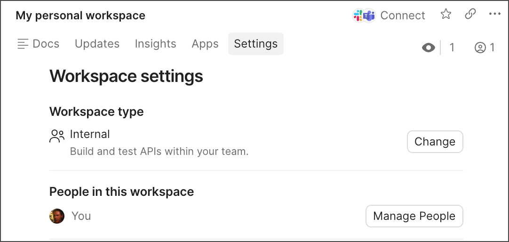

# Workspaces

| Field | Value |
|--------|-------|
| Audience | Beginners with little or no experience working with APIs |
| Document Type | Concept |
| Estimated Reading Time | 5–7 minutes |
| Prerequisites | Collections |

---

# Purpose

This guide introduces **Postman Workspaces**, the highest level of organization in Postman. By the end of this guide, you will understand what workspaces are, why they are useful, and the different types of workspaces available.

---

# What is a Workspace?

A **Workspace** is the top-level container that organizes your work in Postman.

While **Collections** organize related API requests, **Workspaces** organize entire projects. A workspace can contain multiple collections along with other Postman elements such as environments, APIs, mocks, monitors, and documentation.

Think of a workspace as a project folder that keeps everything related to an API in one place.

---

# Why use Workspaces?

Workspaces help you:

- Organize related API projects.
- Keep collections, environments, and other resources together.
- Separate personal work from team projects.
- Collaborate with teammates in a shared space.
- Switch easily between different projects.

For example, you might create separate workspaces for:

- Weather API
- E-commerce API
- Banking API
- Learning and practice

Each workspace contains only the resources related to that project.

---

# Workspace types

Postman provides different workspace types depending on who should have access.

### Internal

An **Internal** workspace is designed for personal or team collaboration. Depending on your account and permissions, it can be visible only to you, the people you invite, or your team.

This is the default workspace type created when you first sign in to Postman.

### Partner

A **Partner** workspace allows invited external partners to collaborate with your team.

### Public

A **Public** workspace allows anyone to view and collaborate with publicly shared API resources through the Postman API Network.

For most beginners, you'll primarily work with **Internal** workspaces.

---

# Creating a Workspace

To create a new workspace:

1. Click **Workspaces** in the header.
2. Select **Create**.
3. Enter a name for the workspace.
4. Choose a workspace type.
5. Click **Create Workspace**.



*Figure 1. Creating a new workspace.*

> **Image Credit**
>
> Adapted from the Postman Learning Center documentation. Original image © Postman, Inc. Used for educational purposes. :contentReference[oaicite:0]{index=0}

---

# Changing a Workspace Type

You can change the type of a workspace after it has been created.

To do this:

1. Open the workspace.
2. Select **Settings**.
3. Under **Workspace type**, click **Change**.



*Figure 2. Changing the workspace type.*

> **Image Credit**
>
> Adapted from the Postman Learning Center documentation. Original image © Postman, Inc. Used for educational purposes. :contentReference[oaicite:1]{index=1}

---

# Workspaces and Collections

A workspace can contain multiple collections.

For example:

```
Workspace: Weather API
│
├── Collection: Current Weather
├── Collection: Forecast
├── Collection: Air Quality
└── Collection: Authentication
```

This structure allows you to organize an entire API project within a single workspace.

---

# Verification

After reading this guide, you should be able to:

- Explain what a Postman workspace is.
- Describe the purpose of a workspace.
- Identify the three workspace types.
- Create a new workspace.
- Explain the relationship between workspaces and collections.

---

# Summary

In this guide, you learned that workspaces are the highest level of organization in Postman.

You should now understand that workspaces:

- Organize API projects.
- Contain collections and other Postman resources.
- Support personal and team collaboration.
- Can be Internal, Partner, or Public.

In the next guide, you will begin working with **Environments**, which allow you to reuse values such as URLs, API keys, and tokens across requests.

---

# Related documentation

- Previous guide: **Collections**
- Next guide: **Environments**
